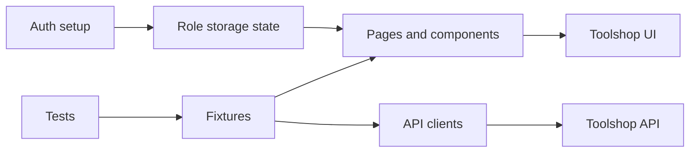

# Toolshop Playwright E2E

A production-oriented TypeScript and Playwright framework for end-to-end testing of [Practice Software Testing](https://practicesoftwaretesting.com).


[Live HTML report](https://yousef-maraqa.github.io/toolshop-playwright-e2e/)

The framework covers typed API clients, API-based authentication, reusable page objects and fixtures, UI/API/hybrid checks, accessibility scans, CI, Docker, and defect documentation.

## Coverage

| Area          | Current coverage                                                                   |
| ------------- | ---------------------------------------------------------------------------------- |
| UI            | Login, validation, catalog/filter/sort/pagination, product/cart, checkout, logout  |
| API           | Authentication, products, brands, search/filtering, cart lifecycle, Zod validation |
| Hybrid        | Product/cart comparison and admin brand creation with UI verification              |
| Accessibility | Home, product, login, and checkout with serious/critical Axe gating                |

## Prerequisites

- Node.js current LTS
- npm
- Internet access for the public Toolshop environment

## Setup

```bash
npm ci
npx playwright install
copy .env.example .env
```

On macOS/Linux, use `cp .env.example .env` instead of `copy`.

The default environment is `prod`. Set `ENV` in `.env` to one of:

- `prod`
- `with-bugs`
- `sprint4`
- `local`

`AUTH_ROLES` controls which API-authenticated states setup generates. It defaults to `customer`; use `AUTH_ROLES=admin,customer` when admin state is needed.

CI requires repository secrets named `TEST_ADMIN_EMAIL`, `TEST_ADMIN_PASSWORD`, `TEST_CUSTOMER_EMAIL`, and `TEST_CUSTOMER_PASSWORD`. The public demo values are documented in `.env.example`; do not commit `.env`.

## Commands

```bash
npm test
npm run test:smoke
npm run test:smoke -- --project=chromium
npm run test:ui
npm run test:api
npm run test:checkout
npm run test:a11y
npm run lint
npm run typecheck
npm run format:check
npm run format
npm run report
```

To list tests against the intentional-bugs environment in PowerShell:

```powershell
$env:ENV='with-bugs'; npx playwright test --list
```

On macOS/Linux:

```bash
ENV=with-bugs npx playwright test --list
```

Run one browser explicitly with `--project=chromium`, `--project=firefox`, or `--project=webkit`.

Admin hybrid coverage is opt-in:

```powershell
$env:AUTH_ROLES='admin,customer'; npx playwright test tests/hybrid --project=admin-chromium
```

Run the suite in Docker with the local environment configured in `.env`:

```bash
docker compose run --rm tests
```

For a local Toolshop Docker stack, set `ENV=local` and start the application services before running the tests.

See [the architecture guide](docs/architecture.md) for layer responsibilities and [the defect report](docs/bugs-found.md) for findings from the intentional-bugs and accessibility runs.

## Test conventions

Tests use Playwright web-first assertions and user-facing locators. Hard waits are not used. The configured test ID attribute is `data-test`. Tests are designed to run independently and in parallel.

## Architecture



See [the architecture guide](docs/architecture.md) for layer responsibilities and design decisions.
