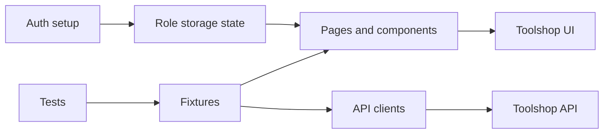

# Architecture

## Layers

### Tests

Tests express business behavior and assertions. They select the role and browser through Playwright configuration or `test.use`, and they do not construct page objects directly.

### Fixtures

`src/fixtures/index.ts` extends Playwright's `test` with page objects and API clients. This keeps test setup consistent and makes dependencies explicit in test signatures.

### Page objects and components

Page objects own route navigation, locators, and user actions. Shared navigation, product cards, and catalog filters are modeled as components and reused by page objects. Assertions remain in tests.

### API clients

`BaseApi` owns request execution, bearer headers, JSON decoding, and non-success errors. `AuthApi`, `ProductsApi`, and `CartApi` expose typed domain operations. Zod schemas validate response data at the API boundary so tests consume trusted types.

### Authentication

`tests/setup/auth.setup.ts` logs in through the API, injects the returned JWT into the application's `auth-token` localStorage key, and writes role-specific storage state files. Browser projects depend on setup and default to the customer state; individual tests can select the admin state.

### Environments

`src/config/environments.ts` is the single source of UI/API endpoint ownership. `ENV` selects `prod`, `with-bugs`, `sprint4`, or `local`, defaulting to `prod`.

## Execution flow

## Design decisions

- API login keeps UI tests focused on the behavior under test and avoids repeating a brittle login flow.
- Storage state is generated per role and ignored by Git.
- No hard waits are used; actions synchronize on navigation, responses, or web-first assertions.
- Tests that create carts delete them in `finally` blocks through the API.
- CI uses four Playwright shards and merges blob reports into a single HTML report.
